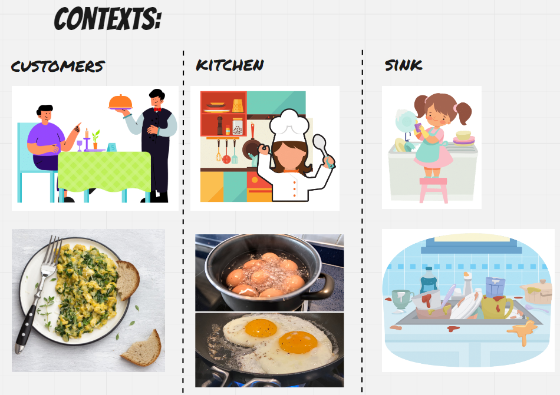

# Modular Monolith 


[source](https://blog.cleancoder.com/uncle-bob/2012/08/13/the-clean-architecture.html)

This project is an example of Modular Monolith with Onion Architecture. Communication between the modules is implemented with events and Event Bus.
Onion Architecture

## Event Bus
Event Bus is a subset of [Publish-Subscribe patterns](https://en.wikipedia.org/wiki/Publish%E2%80%93subscribe_pattern). It's a combination of [Observer](https://en.wikipedia.org/wiki/Observer_pattern) and [Mediator](https://en.wikipedia.org/wiki/Mediator_pattern#:~:text=In%20software%20engineering%2C%20the%20mediator,alter%20the%20program's%20running%20behavior.&text=This%20reduces%20the%20dependencies%20between%20communicating%20objects%2C%20thereby%20reducing%20coupling.) pattern. It's implementation can vary in other languages and frameworks, here's my Java example.

Event Bus is an architectural pattern it's used in distributed asynchronous architecture to create highly scalable reactive applications. It provides loosely coupling between different components. 


[Check Microsoft page](https://docs.microsoft.com/en-us/dotnet/architecture/microservices/multi-container-microservice-net-applications/integration-domainEvent-based-microservice-communications)

## Domain 

The domain is based on restaurant which serves eggs.

#### No Database

The project contains only InMemory Repository since it is used only for learning purposes. 

#### Modules
```java
├─┬ eggrestaurant
│ ├── commons
│ ├── cooking
│ ├── restaurant
│ └── wash
```

### Contexts
Domain is based on 3 subdomains since egg means something else for different actors.
* for customer egg means something to eat. 
* for cook it means an ingredient to make a meal.
* for dishwasher it means nothing else but ugly slush to wash...

